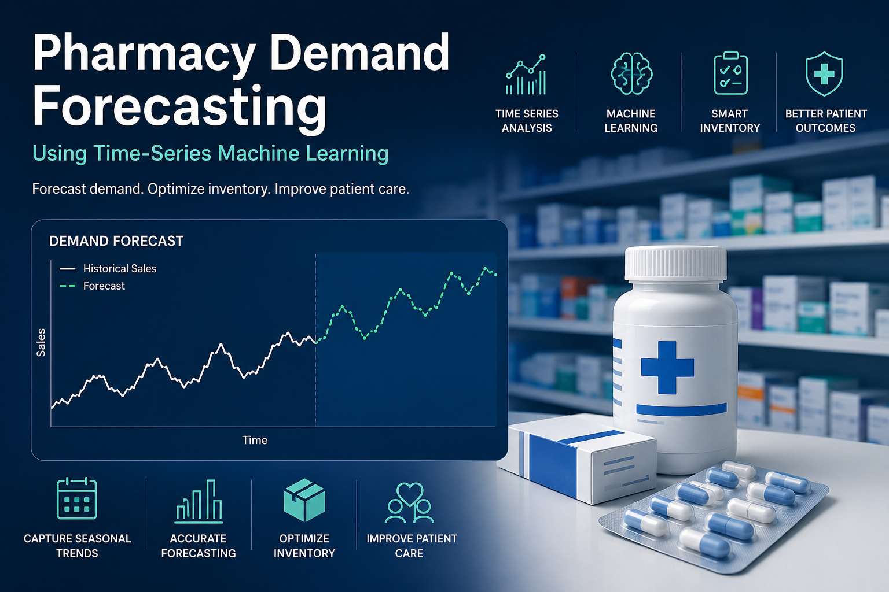

# 💊 PharmaCast
### Predicting Demand. Protecting Patients. Optimising Inventory.

---



One of the most common challenges in the pharmaceutical supply chain is **inventory distortion** — the imbalance between overstocking and understocking. 

**For a typical retail business, a stockout means a lost sale. In the pharmaceutical industry, the stakes are infinitely higher — it can mean a delay in life-saving treatment. This immense responsibility is why effective pharmacy inventory forecasting is not just a good business practice, but a critical component of patient safety.**

This project builds a **machine learning forecasting model** that helps pharmacies anticipate demand and make smarter inventory decisions using historical sales data. But more than a model — it tells the story of how raw numbers become business insight.

---

## 🎯 The Problem

Pharmacies operate under compounding pressures: unpredictable demand, short product shelf lives, strict regulatory requirements, and the ever-present risk of stockouts on critical medications. 

This project asks a more useful question:

> **Can we predict tomorrow's sales well enough to make better inventory decisions today?**

---

## 💡 What This Project Found

Running this model on six years of real pharmacy data produced findings that go beyond forecast accuracy:

- **N02BE (Paracetamol) accounts for 49.4% of all sales** and carries a **115% seasonal swing** — demand more than doubles from July to January
- **Saturday is the busiest day of the week**, challenging the standard assumption of reduced weekend demand
- **Weekly seasonality is functionally absent (1.2%)** — patients come when they need medication, not on a weekly schedule
- **Annual seasonality is strong and clinically logical** — winter illness season drives a 55% swing in total daily demand
- **Both models achieve ~22% MAPE**, landing precisely within the 15–25% ceiling predicted by decomposition analysis before any model was trained

---

## 📁 Project Structure

```
PharmaCast/
│
├── data/
│   └── pharma-sales-data/         # Place dataset here (not tracked by git)
│       └── salesdaily.csv
│
├── outputs/                       # Generated plots saved by the notebook
│   ├── 01_exploratory_overview.png
│   ├── 01b_drug_composition.png
│   ├── 02_decomposition_comparison.png
│   ├── 03_actual_vs_predicted.png
│   ├── 04_feature_importance.png
│   ├── 05_residual_analysis.png
│   ├── 06_prediction_confidence.png
│   └── 07_scorecard.png
│
├── pharma_sales_forecast.ipynb    # Full narrative analysis notebook
├── requirements.txt
├── .gitignore
└── README.md
```

---

## 📊 The Dataset

**Source:** [Pharma Sales Data — Milan Zdravkovic on Kaggle](https://www.kaggle.com/datasets/milanzdravkovic/pharma-sales-data)


The model was trained on a pharmacy sales dataset obtained from Kaggle, containing historical transactional sales records from 2014–2019. 


| Column | Drug Class | Representative Medicines |
|--------|-----------|--------------------------|
| M01AB | Anti-inflammatory — Acetic acid derivatives | Diclofenac |
| M01AE | Anti-inflammatory — Propionic acid derivatives | Ibuprofen |
| N02BA | Analgesics — Salicylic acid derivatives | Aspirin |
| N02BE | Analgesics — Anilides | Paracetamol |
| N05B  | Psycholeptics — Anxiolytics | Diazepam |
| N05C  | Psycholeptics — Hypnotics & Sedatives | Sleeping medications |
| R03   | Obstructive airway diseases | Asthma inhalers |
| R06   | Antihistamines | Antiallergics |

### Getting the Data

The dataset is not included in this repository. To set it up locally:

**Option 1 — Download manually (recommended)**

1. Go to [https://www.kaggle.com/datasets/milanzdravkovic/pharma-sales-data](https://www.kaggle.com/datasets/milanzdravkovic/pharma-sales-data)
2. Click **Download**
3. Extract and place `salesdaily.csv` at:

```
PharmaCast/data/pharma-sales-data/salesdaily.csv
```

The notebook reads the file from this path. No other configuration is needed.

**Option 2 — Download via kagglehub**

```bash
pip install kagglehub
```

```python
import kagglehub
from kagglehub import KaggleDatasetAdapter

df = kagglehub.load_dataset(
    KaggleDatasetAdapter.PANDAS,
    "milanzdravkovic/pharma-sales-data",
    ""
)
```

> A Kaggle account and configured API token are required for Option 2.  
> See [Kaggle API setup](https://github.com/Kaggle/kagglehub) for instructions.

---

## 📈 Results

| Metric | Linear Regression | Random Forest |
|--------|:-----------------:|:-------------:|
| MAPE   | 22.4%             | 22.0%         |
| RMSE   | 19.8 units        | 19.2 units    |
| R²     | 0.267             | 0.308         |
| Mean residual | +1.6 units | +1.3 units   |

Random Forest wins on every metric — but only marginally. A 0.4 MAPE point gap is not an operational distinction. The underlying relationship between sales features and future demand is essentially linear, which means **Linear Regression is the recommended production model**: equal accuracy, full transparency, and every forecast explainable without a data scientist in the room.

Both mean residuals sit near zero — the model has no directional bias. Errors cancel over time rather than compounding into systematic over- or under-stocking.

---

## 📓 The Notebook

The core of this project is not the code — it is the story the code tells.

`pharma_sales_forecast.ipynb` is written as a **narrative analysis**: each chapter answers a business question, explains what the visualisation reveals, and closes with a concrete recommendation. It is designed to be read by both data scientists and non-technical stakeholders.

---

## 🔑 Key Features

| Feature | Description |
|---------|-------------|
| **Time-Series Decomposition** | Separates sales into trend, seasonality, and residual — tested at both weekly and monthly periods |
| **Leakage-Free Engineering** | Rolling features computed with `shift(1)` before `rolling()` — no future data leaks into training |
| **N02BE-Specific Features** | Dedicated lag and rolling features for the dominant category (49.4% of volume, 115% seasonal swing) |
| **Dual Model Comparison** | Random Forest vs. Linear Regression — complexity validated against a proper baseline |
| **Residual Analysis** | Diagnoses where and when the model struggles, with directional bias quantified |
| **Confidence Scoring** | Every forecast classified as High / Medium / Low with corresponding procurement actions |

---

## 🛠️ Getting Started

**1. Clone the repository**
```bash
git clone https://github.com/yourusername/PharmaCast.git
cd PharmaCast
```

**2. Install dependencies**
```bash
pip install -r requirements.txt
```

**3. Add the dataset**

Download `salesdaily.csv` from Kaggle and place it at `data/pharma-sales-data/salesdaily.csv`.  
See [Getting the Data](#getting-the-data) above for full instructions.

**4. Create the outputs folder**
```bash
mkdir outputs
```

**5. Run the notebook**
```bash
jupyter notebook pharma_sales_forecast.ipynb
```

Run all cells from top to bottom. Each chapter builds on the previous one.

---

## ⚠️ Limitations & Honest Caveats

This model is a decision-support tool, not a crystal ball.

- **External events are invisible to the model.** Illness outbreaks, bulk institutional orders, and competitor stockouts drive 55.7% of daily variation — they cannot be predicted from sales history alone
- **The model requires 60 days of warm-up history** and cannot be deployed on day one of a new store or new product SKU
- **Two unexplained demand spikes (2017, 2019) are the largest source of error.** Until their cause is investigated and annotated, they represent an unresolvable noise contribution
- **Retrain monthly.** If MAPE exceeds 25% or mean residual drifts beyond ±5 units on fresh data, the model has drifted from current market reality
- **Total sales forecasting hides category-level variation.** N02BE's 115% seasonal swing is diluted by seven near-flat profiles — SKU-level forecasting is the intended next phase
- **Decomposition testing confirmed that weekly and monthly seasonality are negligible (1.2–1.5%).** Annual seasonality is real and strong but requires period=365 to isolate directly

---

## 🚀 Roadmap

- [ ] Dedicated N02BE forecast model — isolating the dominant category's 115% seasonal signal
- [ ] SKU-level forecasting across all 8 drug categories
- [ ] External signals: flu season index, weather, hospital admission rates
- [ ] Event calendar feature: promotions, public holidays, stockout flags
- [ ] Automated monthly retraining pipeline with drift detection
- [ ] Interactive dashboard for non-technical pharmacy staff

---

## 👤 Author's Note

If the forecast helps a single pharmacy avoid a stockout on a critical medication, the project has achieved its purpose.

---

*Built with Python · scikit-learn · statsmodels · pandas · matplotlib*
